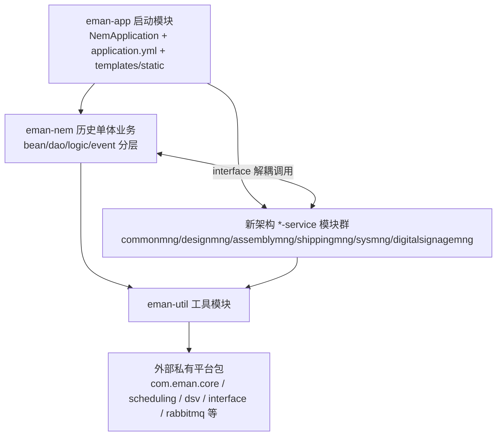
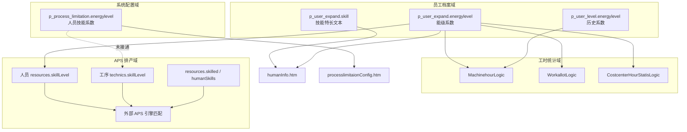

# EMan（益模制造执行系统）技术架构与「技能」专题分析报告

> 分析对象：`e:\yxworkspace\nem-release2.0-master`
> 项目版本：`6.0.0`（`revision`） | Spring Boot `2.1.0.RELEASE` | JDK `1.8`
> 分析方式：只读代码与配置探索，未修改任何业务代码
> 生成时间：2026-07-02（含补充完善版）

---

# 第一部分　总体技术架构

## 一、总体架构概览

EMan 是一套面向**模具制造/装配行业**的 MES（制造执行系统），采用 **Maven 多模块 + 单体运行时** 架构：

- **运行时入口**：`eman-app` 打包为可执行 Fat JAR，主类 `com.eman.NemApplication`
- **历史业务主体**：`eman-nem` 承载绝大部分遗留业务（数千 Java 文件 + 约 2824 个 Freemarker 模板）
- **新架构业务模块**：按 `interface / model / service` 三层拆分，逐步从 `eman-nem` 迁出
- **平台能力**：大量框架能力来自外部私有 JAR（`com.eman.core`、`com.eman.interface` 等），而非本仓库源码



证据：`pom.xml`（modules、parent、dependencies）、`README.md`

---

## 二、整体模块结构与依赖关系

### 2.1 根模块与子模块清单

| 模块 | 类型 | 作用 |
|------|------|------|
| `eman-app` | jar | **启动模块**：主类、配置文件、Freemarker 模板、静态资源 |
| `eman-nem` | jar | **历史全量业务代码**，逐步迁移到新模块 |
| `eman-util` | jar | 工具类、通用 Bean、ES/SMS/Excel 等辅助能力 |
| `eman-commonmng` | pom 聚合 | 公共管理：编码规则、数据字典、系统参数等 |
| `eman-integrationmng` | pom 聚合 | 系统集成接口（APS、金蝶等），**当前仅有 POM 骨架**，无 `src/main/java` |
| `eman-sysmng` | pom 聚合 | 系统配置（如资源预警、设备） |
| `eman-designmng` | pom 聚合 | 设计管理：BOM、设计任务、图档等 |
| `eman-assemblymng` | pom 聚合 | 装配管理：装配工单、任务、工艺 |
| `eman-shippingmng` | pom 聚合 | 发运管理：发货单、装箱单、调模任务 |
| `eman-digitalsignagemng` | pom 聚合 | 电子看板：资源异常预警等 |
| `eman-sdk` | jar | **二开 SDK**：`product` profile 下合并全项目 class 输出 |

每个 `*mng` 聚合模块均拆为：

- `*-model`：DTO/VO/枚举/常量
- `*-interface`：跨模块契约接口
- `*-service`：实现、Controller(Event)、领域服务、DAO

证据：`pom.xml` L20-L42、`README.md` L8-L24

> **备注**：仓库中还存在 `eman-moldtrialmng`（试模管理，含 `eman-moldtrialmng-model`/`-interface`/`-service` 三个子模块，且拥有自己完整的 `pom.xml`，`parent` 正确指向根 `pom.xml`），但**未列入根 `pom.xml` 的 `<modules>` 列表**，且是 git 未跟踪（`?? eman-moldtrialmng/`）的新增目录，属于已搭好骨架、尚未并入主构建的迁移中模块。

### 2.2 关键依赖链

**父 POM**（`com.eman.nem`）向所有子模块继承完整技术栈依赖（Web、MyBatis、Redis、ES、LiteFlow 等）。

**`eman-app` 依赖**：

```
eman-nem
├── eman-commonmng-service
├── eman-integrationmng-service
├── eman-digitalsignagemng-service
├── eman-sysmng-service
├── eman-designmng-service
├── eman-assemblymng-service
├── eman-shippingmng-service
└── spring-boot-starter-amqp (RabbitMQ)
```

**`eman-nem` 依赖**：

- `eman-designmng-interface`
- `eman-assemblymng-interface`
- `eman-commonmng-interface`
- `eman-util`（重复声明两次，历史遗留）

**新模块典型依赖**（以 `eman-designmng-service` 为例）：

- `designmng-interface` + `designmng-model` + `eman-util`
- 部分模块还依赖 `eman-commonmng-service`（如设计模块）

**`eman-util`** 依赖 `eman-commonmng-model`。

**`eman-sdk`** 依赖 `eman-app` + `eman-nem` + 全部 interface/model/service，用于对外发布二开包。

### 2.3 新架构 vs 旧模块：演进思路

| 维度 | 旧架构 (`eman-nem`) | 新架构 (`*-interface/model/service`) |
|------|---------------------|--------------------------------------|
| 包结构 | `com.eman.{业务域}/{bean,dao,logic,event}` | `com.eman.{域}.interfaces` / `model` / `service.{presentation,application,domain}` |
| 控制器 | `*Event`（`@Controller`） | `presentation.event.*Event` |
| 业务层 | `*Logic`（`@Service`） | `application.logic.*AppService` + `domain.service.*DomainService` |
| 数据层 | `*Dao` + `*.m` MyBatis 映射 | `domain.dao.*Dao` + `*.m` |
| 跨模块调用 | 直接依赖 Logic/Bean | 通过 `*Interface` 解耦 |

**桥接模式**：`eman-nem` 中的旧 Logic 通过 Spring 注入新模块 Interface 调用新实现。例如：

- `PartdesignLogic` 注入 `BomcontentInterface`、`AssyWorkOrderInterface`（`eman-nem/.../worktech/logic/PartdesignLogic.java`）
- `TypicalprocessLogic`、`ProcessPlanningLogic` 注入 `BomcontentInterface`

**迁移状态**：

- 已迁出并有实质代码：`commonmng`、`designmng`、`assemblymng`、`shippingmng`、`sysmng`、`digitalsignagemng`
- 占位/空壳：`integrationmng`（无 `src/main/java`）
- 大量业务仍在 `eman-nem`（采购、库存、品质、现场、APS、报表等）
- `eman-nem` 内出现过渡包 `com.eman.business.*`（新命名规范 + 旧分层），如 `business/promanager`、`business/designmanager`、`business/baseinfo`、`business/auxiliaryschedule`

### 2.4 命名规范（来自 README）

```
包名命名规范
1、业务模块 com.eman.business.xxxx
    1.1 业务模块包名
        bean：bean对象
        dao：dao层及SQL文件
        logic：逻辑处理层
        event：接口层
2、接口模块 com.eman.interface.xxxx
    2.1 接口模块包名
        bean：bean对象
        logic：逻辑处理层
        event：接口层

类名命名规范
1 业务模块类名
    bean：xxxDTO与xxxVO
    dao：xxxDao与xxxdao.m
    logic：xxxLogic
    event：xxxEvent
2 接口模块类名
    bean：xxxReq与xxxRep
    logic：xxxApiLogic
    event：xxxApiEvent
```

---

## 三、启动模块 `eman-app`

### 3.1 目录结构（核心）

```
eman-app/
├── pom.xml
└── src/main/
    ├── java/com/eman/NemApplication.java          # 主启动类
    └── resources/
        ├── application.yml                        # 主配置
        ├── application-xm.yml                     # 激活 profile (xm)
        ├── pool.properties                        # 多数据源连接池
        ├── logback-spring.xml                     # 日志
        ├── sap.properties                         # SAP JCo 连接
        ├── templates/                              # Freemarker 页面 (~2824 .htm)
        └── static/                                 # 静态资源 + webjars
```

### 3.2 主启动类 `NemApplication`

```26:32:e:\yxworkspace\nem-release2.0-master\eman-app\src\main\java\com\eman\NemApplication.java
@SpringBootApplication(exclude = { DataSourceAutoConfiguration.class, SecurityAutoConfiguration.class, RabbitAutoConfiguration.class })
@Import({ MultiDataSourcecfg.class })
@ServletComponentScan(value = "com.eman.core.config")
@EnableScheduling
@EnableSwagger2
@EnableAsync
public class NemApplication extends SpringBootServletInitializer {
```

关键设计：

| 注解/配置 | 含义 |
|-----------|------|
| `@SpringBootApplication(exclude = {DataSourceAutoConfiguration, SecurityAutoConfiguration, RabbitAutoConfiguration})` | 禁用 Spring Boot 默认的数据源、安全、Rabbit 自动配置 |
| `@Import(MultiDataSourcecfg.class)` | 自定义多数据源 |
| `@ServletComponentScan("com.eman.core.config")` | 扫描 Servlet 组件 |
| `@EnableScheduling` / `@EnableAsync` | 定时任务、异步 |
| `@EnableSwagger2` | Swagger API 文档 |
| `extends SpringBootServletInitializer` | 支持 WAR 部署到外部 Tomcat |

### 3.3 中间件与技术组件配置

#### 3.3.1 `application.yml`

| 组件 | 配置要点 |
|------|----------|
| **Tomcat** | 端口 `8008`，context-path `/nem`，max-threads 1000，上传 100MB |
| **Profile** | `spring.profiles.active: xm` → 加载 `application-xm.yml` |
| **Redis** | host/port/password/lettuce 连接池（max-active 16、min-idle 2） |
| **MongoDB** | `spring.data.mongodb.uri`，连接 `eman_test` 库 |
| **RabbitMQ** | `spring.rabbitmq.*`，`enable: false`（默认关闭），含 APS 排产成功队列动态绑定（`consumerclassname: com.eman.interfaces.aps.consumer.ApsReleaseConsumer`） |
| **CAS 单点登录** | `spring.cas.*`，`casEnabled: false` |
| **LiteFlow** | 规则存 DB 表 `p_liteflow`，`enable: false` |
| **分布式锁** | `eman.distLockEnable: true`（基于 Redisson） |
| **邮件/FTP/消息** | `emanmail`、`emanftp`、`message`（企业微信集成）等自定义配置段 |

#### 3.3.2 `application-xm.yml`

- 主页：`homepage: baseinfo/homeinfo/home.htm`，主框架：`mainpage: core/main.htm`
- 静态资源外置：`staticresource: d:/emanresources/`
- APS 地址：`aps_url: http://localhost:8223`
- 排产版本：`scheduling: ver4`
- Swagger：`title: NEM Platform API DOC`

#### 3.3.3 `pool.properties`（数据库连接池）

| 数据源 | 技术 | 说明 |
|--------|------|------|
| `master` | **Druid** + **MySQL 8**（`com.mysql.cj.jdbc.Driver`） | 主库，`{database}` 占位 |
| `logdb` | 继承 master | 日志库 `logdb` |
| `slave9` | **HikariCP** + **MariaDB** | 示例从库（AI 库 `ai-nem4`） |
| `slave5`（注释） | SQL Server | 预留多库支持 |

注释中还包含 MariaDB、SQL Server 切换示例。父 POM 同时引入 Oracle、达梦、SQL Server、MySQL、MariaDB 驱动，体现**多数据库可切换**能力，服务于不同客户的现场数据库选型。

#### 3.3.4 其他配置

- **SAP JCo**：`sap.properties`（ashost、sysnr、client、user 等）
- **Elasticsearch**：父 POM 依赖 7.14，运行时代码在 `eman-util`/`eman-nem` 的 `EsUtils`、`ESMapper`（无 yml 显式节点，通常运行时动态配置）
- **日志**：`logback-spring.xml` 分 sql/use/sch/interface 等专用 appender；父 POM 含 plumelog 依赖，但当前 logback 文件未见 plumelog appender 配置，说明该能力已引入但未完全启用
- **Arthas**：根目录存在 `arthas-output` 文件夹（诊断工具输出目录），表明运维侧使用 Arthas 做线上诊断，但不属于代码仓库内配置

---

## 四、`eman-nem` 内部分层与框架模块

### 4.1 外部核心框架（不在本仓库源码内）

`com.eman.core`（4.1.32）等通过 Maven 引入，提供：

- `MultiDataSourcecfg`、`BaseEvent`、`BaseLogic`、`PageData`、`DistributeLock`
- `com.eman.base.*`（`CoreLogic`、`RedisLogic`、`BaseUtil` 等）

业务代码大量 `import com.eman.core.*`、`com.eman.base.*`，说明这是一个"行业业务代码仓库 + 闭源通用框架包"的组合模式，便于框架能力在多个行业产品间复用。

### 4.2 本仓库内框架定制模块

| 包名 | 路径示例 | 用途 |
|------|----------|------|
| `settings` | `eman-nem/.../settings/logic/SettingsLogic.java` | 系统权限、字段配置 |
| `attach` | `eman-nem/.../attach/logic/AttachLogic.java` | 附件管理 |
| `develop` | `eman-nem/.../develop/logic/DevelopLogic.java` | 开发版工程、菜单/国际化维护 |
| `logs` | `eman-nem/.../logs/logic/LogsLogic.java` | 日志管理 |
| `query` | `eman-nem/.../query/event/QueryEvent.java` | 国际化/通用查询 |
| `plugins` | `eman-nem/.../plugins/logic/QSchedulerLogic.java` | 通用设置、Quartz 调度 |
| `cuscom` | `eman-nem/.../cuscom/` | 通用定制、ES 查询 DSL、API 校验、SQLMapperLoader |

### 4.3 旧业务分层命名规范

```
com.eman.{业务域}/
  bean/    → 实体、DTO、VO
  dao/     → Dao 接口 + xxx.m (MyBatis SQL 映射，与 Java 同目录打包)
  logic/   → 业务逻辑 @Service
  event/   → 控制器 @Controller，URL 路由
```

**`.m` 文件**：MyBatis SQL 映射，Maven profile 将 `src/main/java` 下 `**/*.m` 作为资源打包（`pom.xml` L971-L978）。

**Event 示例**：`PartdesignEvent` 继承 `BaseEvent`，`@Controller` + `@RequestMapping`，返回 Freemarker 视图或 `@ResponseBody` JSON（`eman-nem/.../worktech/event/PartdesignEvent.java`）。

### 4.4 业务流程模块全景（`eman-nem` 内，摘自 README + 代码实证）

| 域 | 包名 | 业务 |
|----|------|------|
| 基础 | `basic`, `baseinfo`, `productmaterial` | 基础资料、物料 |
| 项目 | `promanager`, `proplan`, `ordermanager` | 项目管理、计划、报价 |
| 设计工艺 | `worktech`, `mdesign`, `bommanagement` | 工艺规划、设计、BOM |
| 计划执行 | `productionplan`, `schedule`, `scenemanager`, `scenemonitoring` | 车间计划、APS、现场执行 |
| 装配试模 | `workshopplan`, `assemble`, `testmold` | 装配、试模 |
| 供应链 | `orderbillmanager`, `stockmanager`, `oemmanager`, `material` | 采购、库存、外协 |
| 品质刀具 | `quality`, `cutmanager` | 品质、刀具 |
| 集成看板 | `api`, `pdmmanager`, `workshopboard`, `statisticsreport` | 接口、PDM、看板、报表 |
| 系统 | `sysconfig`, `comprehensive`, `mouldactualcost` | 系统配置、综合查询、成本 |
| 企业定制 | `infservices`, `interfaces`, `interfaceService`, `interfaceGF`, `smbmanager`, `omni`, `servinf`, `interfacemanage` | 客户定制接口（com1~com7） |
| 云服务 | `register`, `sysmonitor` | 注册、监控 |
| 新过渡 | `business.*`, `interface.*` | 按新命名规范编写的增量代码 |
| 其他（实际目录中发现，README 未列出） | `andon`, `message`, `workbench`, `mdcsysc`, `wechatapp`, `emMaintenance`, `calendar`, `taskchildsimport`, `searchboxorder`, `interestdatatimer`, `integration` | 安灯系统、消息中心、工作台、设备联网(MDC)、企业微信应用、设备维保、日历、导入任务、搜索框排序、兴趣数据定时、通用集成 |

---

## 五、技术栈清单（根 `pom.xml`）

### 5.1 Web 与基础框架

| 技术 | 版本/说明 |
|------|-----------|
| Spring Boot | 2.1.0.RELEASE |
| Spring Web / WebSocket / AOP | starter 引入 |
| Tomcat | 9.0.111（覆盖父 POM 默认版本） |
| Freemarker | starter + 独立 freemarker |
| Spring Session Core | 会话管理 |
| Spring Mail | 邮件 |
| Apache CXF 3.2.7 | JAX-WS / JAX-RS WebService |
| Swagger (Springfox) | 2.9.2 |
| Hutool | 5.8.8 |
| Lombok | 1.18.24 |
| MapStruct | 1.4.2.Final |

### 5.2 持久层与多数据库

| 技术 | 说明 |
|------|------|
| MyBatis Spring Boot Starter | 1.3.2 |
| HikariCP | 连接池（从库） |
| Druid | 1.1.24（主库，pool.properties） |
| MySQL Connector/J | 9.2.0 |
| MariaDB JDBC | Spring Boot 管理版本 |
| SQL Server JDBC | mssql-jdbc 6.4.0.jre8 |
| Oracle JDBC | com.oracle.ojdbc8 4.0.0 |
| 达梦 DmJdbcDriver18 | 8.1.3.62 |

### 5.3 缓存、锁、搜索

| 技术 | 说明 |
|------|------|
| Spring Data Redis | 缓存/会话 |
| Redisson Spring Boot Starter | 3.16.2，分布式锁（`distLockEnable`） |
| Elasticsearch | 7.14.0（starter + rest-high-level-client） |

### 5.4 消息与任务

| 技术 | 说明 |
|------|------|
| RabbitMQ | `com.eman.platform-core-rabbitmq` + `spring-boot-starter-amqp` |
| Quartz | `spring-boot-starter-quartz` |
| LiteFlow | 2.9.0（含 `liteflow-rule-sql`，规则存 DB） |

### 5.5 文档与报表

| 技术 | 说明 |
|------|------|
| Apache POI | poi-ooxml 4.1.2、poi-scratchpad 4.0.0 |
| EasyExcel | 2.2.10 |
| JXLS | 2.12.0 系列（jxls-poi/jxls-jexcel/jxls-reader） |
| iText PDF | itextpdf 5.5.13 + itext-rtf 2.1.7 |
| JasperReports | 6.7.0 |
| jodconverter + LibreOffice JAR | 4.1.0，Office 文档转换 |
| PDFBox、Batik、Barcode4j、ZXing | 2.0.23 / 1.10 / 2.0 / 3.3.3，PDF/SVG/条码处理 |
| xdocreport | 2.0.2 |

### 5.6 规则引擎、调度、ID

| 技术 | 说明 |
|------|------|
| LiteFlow | 业务流程编排 |
| `com.eman.scheduling` | 1.0.192，APS 排产引擎（外部私有包） |
| yitter-idgenerator | 1.0.6，分布式 ID 生成 |

### 5.7 安全与集成

| 技术 | 说明 |
|------|------|
| JWT (jjwt) | 0.7.0 |
| CAS Client | 3.3.3 |
| Spring Security Web | 引入但启动类排除自动配置，实际权限体系自定义 |
| Jasypt Spring Boot Starter | 3.0.2，配置加密 |
| 金蝶 K3Cloud | `k3cloud-webapi-sdk8.0.6` |
| SAP JCo3 | `com.sap.sapjco3` 3.0.16 |
| 阿里云短信 | aliyun-java-sdk-core/dysmsapi |
| 支付宝 SDK | alipay-sdk-java 3.7.4.ALL |
| 中国网建短信 | commons-httpclient |
| 微软邮件客户端 | ews-java-api 2.0 |

### 5.8 日志、监控、加密、质量

| 技术 | 说明 |
|------|------|
| plumelog-logback / plumelog-trace | 3.5.3（依赖已引入） |
| Logback | `logback-spring.xml` 本地多文件滚动 |
| Spring Boot Actuator | 依赖已引入 |
| Micrometer Prometheus | 依赖已引入（未见 yml 端点配置） |
| Arthas | 运维侧线上诊断工具（`arthas-output/` 目录佐证） |
| JaCoCo / Checkstyle | 构建期质量门禁（`fcm-cs-check.xml`） |

### 5.9 EMan 私有平台包（外部依赖，非本仓库源码）

| artifact | 版本 | 用途 |
|----------|------|------|
| com.eman.core | 4.1.32 | 核心框架 |
| com.eman.interface | 4.1.30 | 接口平台 |
| com.eman.platform-core-rabbitmq | 4.0.108 | RabbitMQ 平台封装 |
| com.eman.dsv | 2.1.9 | 数据服务 |
| com.eman.scheduling | 1.0.192 | APS 排产引擎 |
| com.eman.cleansing | 1.1.6 | AI 数据清洗 |
| com.eman.emanintf | 1.0.0 | 接口定义 |
| com.eman.jgranddog | 1.0.1 | （内部工具包） |
| com.eman.spire | 5.1.0 | （内部工具包） |
| com.eman.soapui | 1.1.1 | （内部工具包） |

---

## 六、前端技术

### 6.1 模板引擎：Freemarker + `.htm` 后缀

- Spring Boot Freemarker Starter 已引入
- 模板目录：`eman-app/src/main/resources/templates/`（约 **2824** 个 `.htm` 文件）
- 模板语法实证：`<#assign>`、`<#list>`、`<@c.css />` 等（`templates/core/main.htm`）
- MVC 配置：`spring.mvc.view.prefix: /`

### 6.2 静态资源与 UI 库

| 资源 | 说明 |
|------|------|
| `webjars/bycdao-ui/` | 自研/封装 UI 套件 |
| Layui | 表格、表单、弹层 |
| Bootstrap 3 | 布局 |
| jQuery 1.9.1 | DOM/Ajax |
| **Ace Editor** | `webjars/bycdao-ui/ace-editor/ace.js`，用于代码/规则编辑 |
| Swagger Bootstrap UI | API 文档前端 |
| ECharts（后端依赖） | 报表图表 |

另有 `static/file/*.jrxml` JasperReports 报表模板。

### 6.3 应用风格：传统 MPA（多页面应用）

- 服务端渲染 HTML 片段，Ajax 局部刷新（`data-url="../gc/xxxxx"` 模式）
- 主框架 `core/main.htm` 采用 Tab + 侧边栏布局
- **局部 Vue**：少数页面如 `*Vue.htm`（`statisticsreport/mouldOperation/`）嵌入 Vue，但整体仍是 MPA 而非 SPA 工程化前端

---

## 七、数据库设计与管理

### 7.1 `db` 目录组织

```
db/
├── MySql/
│   ├── SQLupdate/          # 主升级脚本池（按时间戳命名）
│   ├── 202210_12/          # 按版本批次归档
│   ├── 202307_09/
│   ├── 202310_12/
│   └── ...
├── SqlServer/
│   └── SqlServer初始库0410.sql
├── init/                   # 初始化脚本
├── industryConfig/         # 行业初始化 (000_init_mes.sql, 000_init_eman.sql)
└── aiInit/                 # AI 相关库初始化
```

### 7.2 脚本命名与版本管理

**单脚本命名**：`{yyyyMMddHHmm}_NEM_{SQL|DATA}Update_{作者}_m.sql`
示例：`202606011644_NEM_SQLUpdate_kx_m.sql`

**批次目录**：`202210_12` 表示 2022 年第 10-12 月批次合并脚本

**脚本内容特征**：

- 使用自定义存储过程（如 `add_column`）做幂等 DDL/DML，避免重复执行报错
- 通过 `t_sqlver` 表记录已执行脚本（`fname` + `remark` 防重复）
- 支持 `SQLUpdate`（结构/配置）与 `DATAUpdate`（数据修复）两类

### 7.3 多数据库支持

- 脚本以 **MySQL** 为主（DELIMITER、information_schema 语法）
- **SqlServer** 提供完整初始库
- 应用层通过 `pool.properties` 切换驱动与 JDBC URL，服务不同客户现场的数据库选型

---

## 八、构建与部署

### 8.1 Maven Profiles

| Profile | 默认 | `db.file.name` | 用途 |
|---------|------|----------------|------|
| **devp** | 是 | `devp` | **本地开发**：编译 + 资源打包（含 MyBatis `.m`），排除 NEMnode/jsonfiles |
| **test** | 否 | `test` | **测试/集成打包**：Spring Boot repackage Fat JAR，`mainClass=com.eman.NemApplication`，复制 `pool.properties`/`application.yml`/`run.bat` 到 target |
| **product** | 否 | `test` | **产品发布**：跳过测试；jar **排除** NemApplication、yml、system/jsonfiles；生成 **sources jar**；仅保留 templates/static 等资源 |

### 8.2 打包方式

1. **常规运行包**（test profile）：`mvn package -Ptest`，`eman-app` 产出 Spring Boot 可执行 JAR
2. **二开 SDK 包**（product profile on `eman-sdk`）：`maven-assembly-plugin` 合并全 Reactor 模块 `.class`，输出 `eman-sdk.jar` + `eman-sdk-sources.jar` 到根 `target/`
3. **WAR 兼容**：`NemApplication extends SpringBootServletInitializer` 支持外部 Tomcat
4. **MyBatis 映射打包**：所有 profile 均将 `src/main/java/**/*.m` 作为资源打入 JAR

---

## 九、业务模块全景（模具制造 MES）

EMan 覆盖模具制造企业**从设计到发运**的全流程：

| 阶段 | 模块/包 | 能力 |
|------|---------|------|
| 营销/项目 | `ordermanager`, `promanager`, `proplan` | 报价、合同、项目计划 |
| 设计 | `designmng`(新), `mdesign`, `worktech`, `bommanagement`, `pdmmanager` | 设计 BOM、工艺、图档、PDM |
| 计划排产 | `schedule`, `productionplan`, `business/auxiliaryschedule` | APS 排产、资源计划 |
| 车间执行 | `scenemanager`, `scenemonitoring`, `cutmanager` | 现场报工、监控、刀具 |
| 装配 | `assemblymng`(新), `workshopplan`, `assemble` | 装配工单、任务 |
| 试模 | `testmold`（`eman-moldtrialmng` 为新架构迁移中） | 试模记录、负荷 |
| 采购外协 | `orderbillmanager`, `oemmanager` | 采购申请、外协 |
| 仓储 | `stockmanager`, `material` | 入库、出库、盘点、IQC |
| 品质 | `quality` | 检验、异常 |
| 发运 | `shippingmng`(新) | 发货、装箱、调模 |
| 看板决策 | `digitalsignagemng`(新), `workshopboard`, `statisticsreport`, `comprehensive` | OEE、电子看板、报表 |
| 系统 | `sysmng`(新), `sysconfig`, `commonmng`(新), `settings` | 参数、权限、编码规则 |
| 集成 | `integrationmng`, `api`, `interfaces` | ERP/APS/SAP/金蝶对接 |

行业定位：README 与 PDM/模具相关命名（`mouldbase`、`mwpiece`、`testmold`）均表明这是**注塑模具/工装模具制造**场景 MES，而非通用离散装配 MES。

---

## 十、架构评价与演进建议（分析性结论）

1. **双轨架构并存**：`eman-nem` 仍是运行时主干，新模块通过 Interface 被旧代码调用，降低大爆炸式重写风险，是务实的存量系统演进策略。
2. **平台与业务分离**：`com.eman.core` 等外部 JAR 承担框架能力，本仓库聚焦行业业务，利于框架在多产品间复用。
3. **技术栈成熟但偏旧**：Spring Boot 2.1、jjwt 0.7、Springfox 2.9 等版本较老，需关注安全补丁与长期维护成本。
4. **前端为经典 MPA**：Freemarker + jQuery/Layui，维护成本低，但与现代 SPA 体验有差距；Vue 仅点状引入。
5. **集成能力强**：SAP/K3Cloud/APS/RabbitMQ/ES/MongoDB 等多栈并存，体现中大型 MES 的强集成诉求。
6. **待完善模块**：`integrationmng` 空壳、`eman-moldtrialmng` 未入主构建，说明模块化迁移仍在进行中，尚未完全收口。

---

# 第二部分　专题深挖：项目中的「技能」（Skill）功能

## 十一、技能功能全景概述

在 EMan（益模 MES）中，"技能"并非单一概念，而是**两套并行、名称相近但语义不同的能力模型**：

1. **员工档案「技能特长」**：`p_user_expand.skill` 自由文本，用于 HR 信息维护、变更日志、导入导出，**不参与排产算法**。
2. **APS 高级计划排产「技能等级」约束**：以数值型 `skillLevel` 表示人员能力与工艺要求，规则为**人员 skillLevel ≥ 工艺 skillLevel** 方可被选为加工资源；人员侧目前主要复用 `p_user_expand.energylevel`（界面称"能级系数"）。

此外还存在第三组相关但用途不同的字段：**能级系数**用于工时加权统计（机台工时、现场派工、成本中心），**熟练度 skilled** 用于 APS 工时折算（设备取自 `tasktimerate`），**加工要求匹配表** `p_process_limitation.energylevel`（人员技能系数）已建表和配置页，但**尚未接入 APS 排产数据组装**。

核心实现集中在 `eman-nem` 的人力基础信息、辅助排产（`auxiliaryschedule`）、APS 接口（`interfaces.aps`）及 `eman-app` 前端模板；`eman-designmng`、`eman-assemblymng`、`eman-shippingmng`、`eman-integrationmng`、`eman-digitalsignagemng`、`eman-sdk` 等模块**无技能相关实现**。

---

## 十二、数据模型（表/字段清单）

| 表名 | 字段 | 类型 | 含义 | 业务场景 |
|------|------|------|------|----------|
| `p_user_expand` | `skill` | NVARCHAR(255) / varchar | **技能特长**，自由文本 | 员工档案 |
| `p_user_expand` | `energylevel` | NVARCHAR(200) / varchar | **能级系数**（当前值）；APS 中映射为人员 `skillLevel` | 员工档案、工时统计、APS 人员技能 |
| `p_user_expand` | `inscheduling` | int | 是否参与排程（0否/1是） | APS 人力资源筛选 |
| `p_user_level` | `energylevel` | decimal(18,9) | **能级系数历史**（按变更次数 `ordernums` 记录） | 机台工时按时间点取系数 |
| `p_process_limitation` | `energylevel` | DECIMAL(18,6) | **人员技能系数**（按工艺精度区间配置，≥阈值） | 系统配置-加工要求匹配表 |
| `p_process_limitation` | `accuratefrom/accurateto` | decimal | 工艺要求精度区间 | 与技能系数联动配置 |
| `p_process_limitation` | `processdegree` | decimal | 设备精度要求 | 加工要求匹配 |
| `p_productresource_detail` | `tasktimerate` | double | 时间换算/工时系数；APS 映射为设备 `skilled` | 生产资源配置 |
| `aps_work_orders` | `skillLevel` | decimal(18,9) | **工艺需人员技能**（APS 排产输入/输出字段） | APS 引擎侧工序约束 |
| `aps_work_orders` | `appointResource` | int | 指定资源（为1时忽略尺寸/精度/技能等约束） | APS 排产 |
| `t_user` | 多字段 | — | 员工主表（姓名、部门等），通过 `pid` 关联 expand | 人力基础 |

**i18n（国际化）关键键：**

- `ti.skill` →「技能特长」
- `ti.energylevelcoefficient` →「能级系数」
- `ti.rfyrjingxiuu` →「人员技能系数」（加工要求匹配表列头）
- `in.excelyw1319` → Excel 导入列「技能特长」

---

## 十三、两种技能语义的对比说明

| 维度 | (a) 员工档案「技能特长」 | (b) APS「技能等级」约束 |
|------|--------------------------|-------------------------|
| 存储 | `p_user_expand.skill` | 人员：`p_user_expand.energylevel` → APS `skillLevel`；工艺：APS `technics.skillLevel`（理论上应来自精度匹配等配置） |
| 数据类型 | 自由文本（前端 max 200 字） | 数值等级（decimal，0/空=无要求） |
| 维护入口 | 人力信息页 `humanInfo.htm` | 能级系数同页录入；工艺要求拟由「加工要求匹配表」推导（未接通） |
| 业务用途 | 档案、变更日志、导入导出 | APS 引擎人员-工序资源匹配 |
| 校验规则 | 长度校验 | **人员 skillLevel ≥ 工艺 skillLevel**（在 APS 引擎执行，MES 侧无 Java 校验代码） |
| 与 `skill` 文本关系 | — | **完全无关**，文本 skill 不传 APS |

**易混淆的第三概念「能级系数」：** 同名 `energylevel` 在统计报表中用于 **实际工时 × 系数**（薪酬/负荷核算），与 APS 技能匹配共用同一员工字段，但统计场景不读取文本 `skill`。

---

## 十四、代码链路详解（DAO → Logic → Service/Interface → 前端）

### 14.1 场景 A：员工档案「技能特长」文本

```
前端 humanInfo.htm (name="skill")
  → HumanEvent.addOrUpdHuman (/gc/93020)
    → HumanLogic.addcheckData → addHuman / updHuman
      → baseinfo.m: add_p_user_expand / upd_p_user_expand (skill = #{skill})
        → p_user_expand.skill
```

**Excel 导入列映射**（`HumanLogic.findTableInfo`，列序号 `i=28`）：

```1110:1115:e:\yxworkspace\nem-release2.0-master\eman-nem\src\main\java\com\eman\baseinfo\logic\HumanLogic.java
			bean.setFamilystate(temp);
			break;
		case 28:
			// 技能特长
			bean.setSkill(temp);
			break;
```

**能级系数 Excel 导入**（同方法 `case 8`，默认 `"1"`）：

```1038:1043:e:\yxworkspace\nem-release2.0-master\eman-nem\src\main\java\com\eman\baseinfo\logic\HumanLogic.java
		case 8:
			if (BaseUtil.empty(temp) || temp.equals("")) {
				bean.setEnergylevel("1");// 系统默认为1
			} else {
				bean.setEnergylevel(temp);
			}
```

**DAO 查询/更新：**

```4571:4572:e:\yxworkspace\nem-release2.0-master\eman-nem\src\main\java\com\eman\baseinfo\dao\baseinfo.m
		p_user_expand.skill,
		p_user_expand.energylevel,
```

```4650:4651:e:\yxworkspace\nem-release2.0-master\eman-nem\src\main\java\com\eman\baseinfo\dao\baseinfo.m
			trainexperience = #{trainexperience} ,interest = #{interest} ,familystate = #{familystate} ,skill = #{skill},
			energylevel=#{energylevel},contractsigningtime = #{contractsigningtime},
```

**VO 定义：**

```95:101:e:\yxworkspace\nem-release2.0-master\eman-nem\src\main\java\com\eman\business\baseinfo\bean\UserVO.java
    private String interest;
    /**家庭状况*/
    private String familystate;
    /**技能特长*/
    private String skill;
    /**能级系数*/
    private String energylevel;
```

**能级历史**（修改时若系数变化则插入 `p_user_level`）：

```274:278:e:\yxworkspace\nem-release2.0-master\eman-nem\src\main\java\com\eman\baseinfo\logic\HumanLogic.java
		if (BaseUtil.equals(energylevel,bean.getEnergylevel())) {// 不相等
			bean.setRdtime(new Date());// 记录时间
			bean.setUserid(bean.getPid());// 人力id
			bean.setOrdernums((BaseUtil.parseInt(levelInfo.getOrdernums()) + 1) + "");// 次数
			this.dao.add("baseinfo.add_p_user_level", bean);// 插入员工能级信息
```

> **注意（疑似缺陷）**：注释写「不相等」但判断条件用的是 `BaseUtil.equals(...)`，逻辑与注释相悖，可能存在能级变更历史记录条件反写的 bug（此处仅作分析记录，未做代码修改）。

### 14.2 场景 B：APS 辅助排产 V2（当前主链路）

**调用链：**

```
AuxiliaryScheduleLogic.updAuxiliaryScheduleV2
  → AuxiliaryScheduleDataLogic.getApsJson
    → EManNEMDao.getResources (设备 + 人力 + 部门)
    → getResources() 组装 JSON resources 节点
    → getTechnics() 组装工序 technics 节点
  → HTTP POST 至外部 APS 引擎
```

**入口 TODO（人力排产兼容状态，最直接的证据）：**

```77:77:e:\yxworkspace\nem-release2.0-master\eman-nem\src\main\java\com\eman\business\auxiliaryschedule\logic\AuxiliaryScheduleDataLogic.java
        // TODO 人力排产暂未兼容，eman现在只有skillLevel这个字段，skilled classes humanSkills三个字段暂无，目前仅兼容了人力基础信息，负荷、等级、熟练度待兼容
```

**DAO：设备资源 → skilled；人力 → skillLevel：**

```419:420:e:\yxworkspace\nem-release2.0-master\eman-nem\src\main\java\com\eman\business\auxiliaryschedule\dao\emanNem.m
            , pd.tasktimerate      workHourCoeff
            , pd.tasktimerate      skilled
```

```474:475:e:\yxworkspace\nem-release2.0-master\eman-nem\src\main\java\com\eman\business\auxiliaryschedule\dao\emanNem.m
            p_user_expand.energylevel    skillLevel,
            p_user_expand.iffinish    ressStatus
```

**Logic：组装 APS resources JSON（人员部分）：**

```559:594:e:\yxworkspace\nem-release2.0-master\eman-nem\src\main\java\com\eman\business\auxiliaryschedule\logic\AuxiliaryScheduleDataLogic.java
            // (仅针对人员)熟练程度,没有传递此属性默认1;(1=标准(工时*1);1.10=低于标准(工时*1.1;代表更慢加工完成);0.9=高于标准(工时*0.9;代表更快加工完成))
            toResourceNo.put("skilled", resource.getSkilled() == 0 ? 1 : resource.getSkilled());
            // (仅针对设备)是否能外发(1=可外发;0代表资源不可做为外发资源)
            toResourceNo.put("canOutgoing", resource.getCanOutgoing());
            // (仅针对设备)是否外发资源(0代表不是外发资源,1=是外发)
            toResourceNo.put("outgoing", resource.getOutgoing());
            // (仅针对设备)外发周期(H),正整数,默认:0
            toResourceNo.put("outsHour", resource.getOutsHour());
            // (仅针对设备)可加工的最小精度值(单位:毫米=100丝);零件或者空则代表所有精度都可以加工;例如:设定0.008则代表0.008以上的精度都可以加工
            toResourceNo.put("precision", resource.getPrecision());
            // (仅针对人员)人员资源设置的技能等级值;零或者空则代表无人员技能要求(可以加工所有零件);不为零则人员技能值必须大于等于工艺要求技能值才能加工;
            toResourceNo.put("skillLevel", resource.getSkillLevel());
            // (仅针对设备)设备的全行程尺寸:[长*宽*高]或者[直径*长]单位:CM,默认:空;
            toResourceNo.put("machineProcess", resource.getMachineProcess());
            // (仅针对设备)可加工最小尺寸
            toResourceNo.put("lowMachineProcess", resource.getLowMachineProcess());
            ...
            // (仅针对人员)对应不同标准工序的技能等级:零或者空则取对应全局[skillLevel]属性值;零或者空代表无人员技能要求(可以加工所有零件);不为零则人员技能值必须大于等于工艺要求技能值才能加工
            toResourceNo.put("humanSkills", "");
```

> 注：`classes`（班次：1白班2晚班）在同一方法中被硬编码为 `1`，说明当前排产完全未考虑晚班人员的技能可用性。

**Logic：工序侧工艺 skillLevel 当前写死为空（关键缺陷点）：**

```1202:1207:e:\yxworkspace\nem-release2.0-master\eman-nem\src\main\java\com\eman\business\auxiliaryschedule\logic\AuxiliaryScheduleDataLogic.java
            // 零件行程尺寸(X*X*X);该尺寸用于匹配可具体候选的设备尺寸
            technicsNode.put("partProcess",tech.getPartsize());
            // 工艺要求加工精度值(单位:毫米=100丝);零或者空则代表所有精度都可以加工;例如:设定0.008则代表0.008及小于数值的精度设备都可以加工
            technicsNode.put("precision","");
            // 工艺技术水平约束,工艺要求人员技能水平(单位:等级);零或者空则代表无人员技能要求;例如:设定0.08则代表候选人员技能要求等级必须大于等于0.08才能加工
            technicsNode.put("skillLevel","");
```

**Bean 注释（APS 数据契约的完整定义）：**

```193:212:e:\yxworkspace\nem-release2.0-master\eman-nem\src\main\java\com\eman\business\auxiliaryschedule\bean\ApsResourcesVO.java
    /**
     * (仅针对人员)熟练程度,没有传递此属性默认1;(1=标准(工时*1);1.10=低于标准(工时*1.1;代表更慢加工完成);0.9=高于标准(工时*0.9;代表更快加工完成))
     */
    private double skilled;

    /**
     * (仅针对设备)可加工的最小精度值(单位:毫米=100丝);零件或者空则代表所有精度都可以加工;例如:设定0.008则代表0.008以上的精度都可以加工
     */
    private String precision;

    /**
     * (仅针对人员)人员资源设置的技能等级值;零或者空则代表无人员技能要求(可以加工所有零件);不为零则人员技能值必须大于等于工艺要求技能值才能加工
     */
    private String skillLevel;

    /**
     * (仅针对人员)班次:1白班2晚班
     */
```

**人力资源合并逻辑：**

```514:536:e:\yxworkspace\nem-release2.0-master\eman-nem\src\main\java\com\eman\business\auxiliaryschedule\dao\EManNEMDao.java
    public List<ApsResourcesVO> getResources(String plantid){
        List<ApsResourcesVO> list = ... query("emanNem.resources", plantid);
        ...
        List<ApsResourcesVO> humanList = this.getHumanResources(plantid);
        ...
        list.addAll(humanList);
        list.addAll(getHumanDepts);
        return list;
    }
```

参与排程人员过滤（`inscheduling = 1`）在 `getResourceUser` 对应 SQL 中体现。

### 14.3 场景 B 补充：旧版 APS 接口 `ApsServices`（比 V2 更不完整）

**设备资源**传递 `skilled`（来自 `workhourcoeff` / `tasktimerate`）：

```3226:3229:e:\yxworkspace\nem-release2.0-master\eman-nem\src\main\java\com\eman\interfaces\aps\logic\ApsServices.java
            jsonObject.put("templateNo", bean.getTmpid());

            //"熟练程度,没有传递此属性默认1;(1=标准(工时*1);1.10=低于标准(工时*1.1;代表更慢加工完成);0.9=高于标准(工时*0.9;代表更快加工完成))"
            jsonObject.put("skilled", bean.getWorkhourcoeff());
```

**人力资源** `assembleHumanResourcesJson` **仅传基础信息**（resourceNo、templateNo、部门等），**不传 skillLevel / skilled / humanSkills**——这是新旧两套 APS 接口行为不一致的直接证据：

```3317:3335:e:\yxworkspace\nem-release2.0-master\eman-nem\src\main\java\com\eman\interfaces\aps\logic\ApsServices.java
        for (Resources bean : this.apsOperatorUseridMap.values()) {
            JSONObject jsonObject = new JSONObject(6, false, true);
            jsonObject.put("resourceNo", this.getUseridStr(bean.getUserid()));
            jsonObject.put("resourceName", bean.getUsername());
            ...
            jsonObject.put("templateNo", bean.getTmpid());
            jsonObject.put("groupNo", DEPTPREFIX + bean.getDeptid());
            jsonObject.put("groupName", bean.getDeptname());
            jsonArray.add(jsonObject);
```

**appointResource**（指定资源时忽略技能等约束）：

```2620:2626:e:\yxworkspace\nem-release2.0-master\eman-nem\src\main\java\com\eman\interfaces\aps\logic\ApsServices.java

        //"EMan:0:未设置 1:可外协 2:不可外协 3:一定要外协;用户设置;是否能外协"
        procedureJson.put("canExterior", canExterior);
        // "资源指定,是否为指定资源:1是指定,0不是指定;默认0,指定:(代表工序候选资源将不再考虑尺寸,精度,技能等约束规则,代表候选加工资源都可以排产)"
        // 不可外协的工序设置为指定设备，将不考虑尺寸
        procedureJson.put("appointResource", canExterior == 2 ? 1 : 0);
    }
```

### 14.4 加工要求匹配表（人员技能系数配置，已建但未接入 APS）

```
processlimitaionConfig.htm (name="energylevel")
  → SyscinfoEvent.saveProcesslimitation (/gc/139117)
    → SyscinfoLogic.saveProcesslimitation
      → sysconfig.m → p_process_limitation
```

```8614:8626:e:\yxworkspace\nem-release2.0-master\eman-nem\src\main\java\com\eman\sysconfig\dao\sysconfig.m
    <select id="queryProcesslimitationList" ...>
        SELECT pid, accuratefrom, accurateto, energylevel, processdegree, ...
        FROM p_process_limitation
        WHERE plantid = #{_plantid}
```

全库检索显示：**除该配置页面本身的 CRUD 外，没有任何 Logic 读取这张表并把值写入 APS 的 `technics.skillLevel`**——即这是一张"配置了却从未被实际业务流程消费"的表。

### 14.5 能级系数在工时统计中的链路（与 APS 技能匹配是两条独立支线）

| 模块 | 类/方法 | SQL | 用途 |
|------|---------|-----|------|
| 现场派工 | `WorkallotLogic` | `workallot.getenergylevelbyuserids` → `p_user_expand.energylevel` | 派工工时 × 系数 |
| 机台工时 | `MachinehourLogic.getActralWorkTimeBylevle` | `machinehour.getallUserLevel` → `p_user_level` | 按监控时间取历史系数 |
| 成本中心 | `CostcenterHourStatisLogic` | `costcenterhourstatis.m` → `p_user_level.energylevel` | ERP 实际工时折算 |
| 工时计算 | `WorkhourCalLogic` | `workallot.getenergylevelbyuserids` | 用户能级系数 Map |

---

## 十五、前端页面展示与录入

| 页面 | 路径 | 字段 | 控件 |
|------|------|------|------|
| 人力信息维护 | `eman-app/.../baseinfo/human/humanInfo.htm` | 能级系数 | `<input name="energylevel">`，默认 `1`，仅允许数字/小数 |
| 同上 | 同上 | 技能特长 | `<textarea name="skill" check="max[200]">` |
| 同上 | 同上 | 参与排程 | `<select name="inscheduling">` 0/1 |
| 人力变更日志 | `humanlogInfo.htm` | skill / energylevel | 表格列展示，变更标红 |
| 加工要求匹配 | `processlimitaionConfig.htm` | energylevel | 文本输入，列头「人员技能系数（≥）」 |
| 生产资源配置 | `Proresource.htm` | tasktimerate | 时间换算系数（APS skilled 来源） |
| 机台工时报表 | `machinehourData.htm` | level | 展示能级系数列 |

**变更日志列对应：**

```29:40:e:\yxworkspace\nem-release2.0-master\eman-app\src\main\resources\templates\baseinfo\human\humanlogInfo.htm
                    <th ... >${M('ti.energylevelcoefficient')}  </th>
                    ...
                    <th ... >${M('ti.skill')}  </th>
```

---

## 十六、已知限制和待完善点

| 编号 | 问题 | 证据 |
|------|------|------|
| L1 | **人力排产未完全兼容**：仅 `skillLevel` 部分打通；`skilled`、`classes`、`humanSkills` 缺失 | `AuxiliaryScheduleDataLogic` L77 TODO |
| L2 | **工艺侧 skillLevel 恒为空**，技能匹配在输入端实际失效 | `technicsNode.put("skillLevel","")` L1207 |
| L3 | **humanSkills 恒为空字符串**，无法按标准工序差异化配置人员技能 | L594 |
| L4 | **classes 硬编码为 1**（白班），无晚班/班次数据 | L582 附近 |
| L5 | **人员 skilled 未从专用字段读取**；设备误用 `tasktimerate` 作 skilled | `emanNem.m` L420；人员 SQL 无 skilled 映射 |
| L6 | **加工要求匹配表** `p_process_limitation.energylevel` 已配置但**未参与 APS 数据组装** | 全库仅 Syscinfo CRUD |
| L7 | **旧版 `ApsServices` 人力资源不传任何技能字段** | `assembleHumanResourcesJson` |
| L8 | **文本 skill 与 APS 完全割裂**，无结构化技能主数据 | 设计层面 |
| L9 | **appointResource 在部分场景可能被简化处理**（资源指定场景待补充） | `ApsServices` L2623-2625 |
| L10 | **能级系数语义过载**：同一 `energylevel` 兼作工时加权与 APS 技能等级，易混淆 | 架构层面 |
| L11 | `updHuman` 能级历史插入条件注释与代码不一致，疑似逻辑反写 bug | `HumanLogic.java` L274 |

**结论**：MES 内部**无技能匹配校验的 Java 代码**；匹配逻辑完全依赖外部 APS 引擎执行，且需要工艺侧 `skillLevel` 有实际值才能生效——而目前该值恒为空，技能约束规则处于"配置了框架、尚未在生产环境真正生效"的状态。

---

## 十七、误报排除（同名但与技能功能无关）

| 命中 | 实际含义 | 是否技能功能 |
|------|----------|--------------|
| `Syscinfo.skill` / `Proplan.skill` | 数据迁移/大 Bean 中的人力扩展字段副本，注释为「属性1」 | 否（非独立功能） |
| `ti.skillgrouploadrate` / `grouploadrateMain.htm` | 「员工负荷率」统计菜单 | 否 |
| `me.t5g4yhgb` i18n 文案 | 产品介绍文案「降低作业技能」 | 否 |
| `tasktimerate` / `workhourcoeff` | 设备**工时换算系数**；APS 中作 `skilled`（熟练度/工时倍率），非人员技能等级 | 部分相关（APS skilled，非 skillLevel） |
| `ProresourceLogic case 28` | 「工作中心」导入列，与 `HumanLogic` case 28「技能特长」**列号相同但属于不同模块** | 否 |

---

## 十八、技能功能关系简图



---

## 十九、涉及文件清单（按模块分类，技能功能相关）

### eman-nem（核心）

**Bean/VO**
- `business/baseinfo/bean/UserVO.java`
- `baseinfo/bean/Baseinfo.java`
- `business/auxiliaryschedule/bean/ApsResourcesVO.java`
- `business/auxiliaryschedule/bean/ApsScheduleWorkOrderVO.java`
- `sysconfig/bean/Processlimitation.java`
- `interfaces/aps/bean/Resources.java`
- `statisticsreport/bean/Statisticsreport.java`

**DAO / MyBatis**
- `baseinfo/dao/baseinfo.m`
- `business/baseinfo/dao/UserDao.m`
- `business/auxiliaryschedule/dao/emanNem.m`
- `business/auxiliaryschedule/dao/EManNEMDao.java`
- `interfaces/aps/dao/aps.m`
- `interfaces/aps/dao/apsReleaseV2.m`
- `sysconfig/dao/sysconfig.m`
- `scenemonitoring/dao/workallot.m`
- `statisticsreport/dao/machinehour.m`
- `statisticsreport/dao/costcenterhourstatis.m`
- `settings/dao/settings.m`
- `sysconfig/dao/datat4tf.m`、`datatruns.m`、`cuscom/dao/tabletransform.m`、`baseinfotransfer/dao/customertransfer.m`

**Logic / Event / Service**
- `baseinfo/logic/HumanLogic.java`
- `baseinfo/event/HumanEvent.java`
- `business/auxiliaryschedule/logic/AuxiliaryScheduleDataLogic.java`
- `business/auxiliaryschedule/logic/AuxiliaryScheduleLogic.java`
- `business/auxiliaryschedule/event/AuxiliaryScheduleEvent.java`
- `interfaces/aps/logic/ApsServices.java`
- `interfaces/aps/logic/ApsReleaseV2Logic.java`
- `sysconfig/logic/SyscinfoLogic.java`
- `sysconfig/event/SyscinfoEvent.java`
- `statisticsreport/logic/MachinehourLogic.java`
- `scenemonitoring/logic/WorkallotLogic.java`
- `statisticsreport/logic/CostcenterHourStatisLogic.java`
- `sysconfig/logic/WorkhourCalLogic.java`
- `basic/logic/DomainLoginLogic.java`、`api/event/UserApiEvent.java`、`baseinfo/logic/DingTalkUserLogic.java`

### eman-app（前端模板）
- `templates/baseinfo/human/humanInfo.htm`
- `templates/baseinfo/human/humanlogInfo.htm`
- `templates/sysconfig/syscinfo/processlimitaionConfig.htm`
- `templates/sysconfig/syscinfo/processlimitationRow.htm`
- `templates/sysconfig/sysconfigMain.htm`
- `templates/baseinfo/proresource/Proresource.htm`
- `templates/statisticsreport/machinehour/machinehourData.htm`
- `templates/sysconfig/freemakersql/usersexpand.htm`

### eman-commonmng
- `eman-commonmng-model/.../Baseinfo.java`（`skill`、`energylevel` 字段镜像）

### eman-util
- `cuscom/bean/Syscinfo.java`（`skill` 迁移用字段）

### db（脚本）
- `SqlServer/SqlServer初始库0410.sql`（`p_user_expand`、`p_user_level`、`p_process_limitation`、`aps_work_orders`）
- `MySql/SQLupdate/202310_12_NEM_SQLUpdate_kx_m.sql`（`aps_work_orders.skillLevel`）
- `MySql/SQLupdate/202307_09_NEM_SQLUpdate_kx_m.sql`（`p_process_limitation`）
- `MySql/SQLupdate/202412171755_NEM_SQLUpdate_kx_m.sql`
- `MySql/202310_12/202312070000_NEM_SQLUpdate_ls_m.sql`

### 无技能相关代码的模块（已检索确认）
`eman-designmng`、`eman-assemblymng`、`eman-shippingmng`、`eman-integrationmng`、`eman-digitalsignagemng`、`eman-sdk`

---

## 二十、技能功能结论与改进建议方向（分析性，非实施）

1. **当前唯一较完整打通的 APS 技能链路**：`p_user_expand.energylevel` → 辅助排产 V2 `resources.skillLevel`；但工艺侧为空导致匹配规则**实际上不生效**。
2. **「技能特长」文本字段**是独立的 HR 档案功能，与排产完全无关，不应与"技能等级"混为一谈。
3. 若需要让技能匹配真正在排产中生效，建议的补齐优先级为：
   - ① 工艺侧 `skillLevel` 接入（很可能应取数于已建好但闲置的 `p_process_limitation` 配置表）
   - ② `humanSkills` 按标准工序精细化维护
   - ③ 人员 `skilled`（熟练度系数）与 `classes`（班次）的真实取值
   - ④ 统一新旧两套 APS 接口（`ApsServices` 与 `AuxiliaryScheduleDataLogic`）在技能字段上的行为，避免同一套系统里排产结果因走了不同接口而不一致
4. 建议将「能级系数（工时加权）」与「APS 技能等级」在数据模型或 UI 层面**解耦命名**，降低维护和业务理解上的歧义风险。

---

## 二十一、关键文件索引（架构总览，便于快速定位）

| 主题 | 路径 |
|------|------|
| 根 POM / 技术栈 / Profiles | `pom.xml` |
| 模块说明 | `README.md` |
| 启动类 | `eman-app/src/main/java/com/eman/NemApplication.java` |
| 主配置 | `eman-app/src/main/resources/application.yml` |
| 环境配置 | `eman-app/src/main/resources/application-xm.yml` |
| 数据源 | `eman-app/src/main/resources/pool.properties` |
| 日志 | `eman-app/src/main/resources/logback-spring.xml` |
| 主页面模板 | `eman-app/src/main/resources/templates/core/main.htm` |
| 新模块接口示例 | `eman-designmng/eman-designmng-interface/src/main/java/com/eman/designmng/interfaces/BomcontentInterface.java` |
| 新模块 Controller 示例 | `eman-commonmng/eman-commonmng-service/src/main/java/com/eman/emes/commonmng/presentation/event/CodeGenerateManageEvent.java` |
| DB 升级脚本 | `db/MySql/SQLupdate/` |
| SDK 打包描述 | `eman-sdk/src/assembly/sdk.xml` |
| 技能-人力档案入口 | `eman-nem/src/main/java/com/eman/baseinfo/logic/HumanLogic.java` |
| 技能-APS排产V2入口 | `eman-nem/src/main/java/com/eman/business/auxiliaryschedule/logic/AuxiliaryScheduleDataLogic.java` |
| 技能-APS旧接口入口 | `eman-nem/src/main/java/com/eman/interfaces/aps/logic/ApsServices.java` |
| 技能-加工要求匹配表 | `eman-nem/src/main/java/com/eman/sysconfig/dao/sysconfig.m` |

---

*本文档由 AI 对代码仓库进行只读分析生成，用于团队内部技术参考；如后续代码变更，建议重新生成或人工校对相关章节。*
